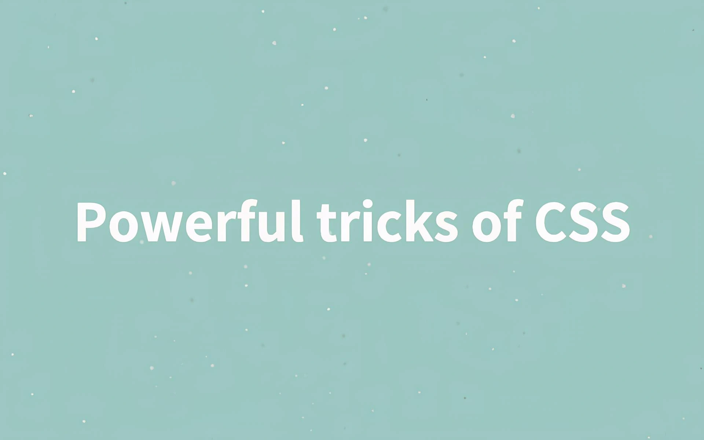

<div align="center">
<a href="" target="_blank">
      
    </a>
  <h3 align="center">CSS Tricks & Good Practices</h3>
</div>

##  <br /> 📋 <a name="table">Table of Contents</a>

- ✨ [Introduction](#introduction)
- ⚙️ [Tech Stack](#tech-stack)
- 🚀 [Quick Start](#quick-start)

##  <br /> <a name="introduction">✨ Introduction</a>

**[EN]** This collection is designed to enhance your CSS skills and deepen your understanding of core CSS concepts. It includes a variety of practical examples and best practices that cover common challenges and advanced techniques in CSS.

**[FR]** Cette collection est conçue pour améliorer vos compétences en CSS et approfondir votre compréhension des concepts de base du CSS. Elle inclut une variété d'exemples pratiques et de bonnes pratiques qui couvrent les défis courants et les techniques avancées en CSS.

<div align="center">
  <h3 align="center">Content</h3>
</div>

- **Sticky Footer**: Creating a footer that sticks to the bottom of the page regardless of content height.

- **Responsive Media Queries**: Using media queries to create responsive designs that look great on all devices.

- **Fullwidth Background Inside a Container**: Techniques to apply a fullwidth background within a constrained container.

- **Flexbox and Grid Layouts**: Modern layout methods to create flexible and efficient page structures.

- **Responsive  Gallery**: Creating a responsive image gallery using Flexbox.

- **Twitch Category Clone**: Reproducing Twitch category layout using CSS Grid.


##  <br /> <a name="tech-stack">⚙️ Tech Stack</a>

- **HTML** (HyperText Markup Language) is the standard markup language used for creating web pages. It provides the structure of a webpage by defining elements such as headings, paragraphs, links, images, and other content. HTML elements are represented by tags, which tell the browser how to display the content.

- **CSS** (Cascading Style Sheets) is a style sheet language used to describe the presentation of a document written in HTML. CSS controls the layout, colors, fonts, and overall visual appearance of web pages. By separating content from design, CSS enables developers to maintain and update the visual style of multiple pages efficiently.
  

## <br /> <a name="quick-start">🚀 Quick Start</a>

Follow these steps to set up the project locally on your machine.

<br/>**Prerequisites**

Make sure you have the following installed on your machine:

- [Git](https://git-scm.com/)
- [Node.js](https://nodejs.org/en)
- [npm](https://www.npmjs.com/) (Node Package Manager)

<br/>**Cloning the Repository**

```bash
git clone {git remote URL}
```

<br/>**Running the Project**

Use [Live Server](https://marketplace.visualstudio.com/items?itemName=ritwickdey.LiveServer)
to launch a development local server with live reload feature for static & dynamic pages.